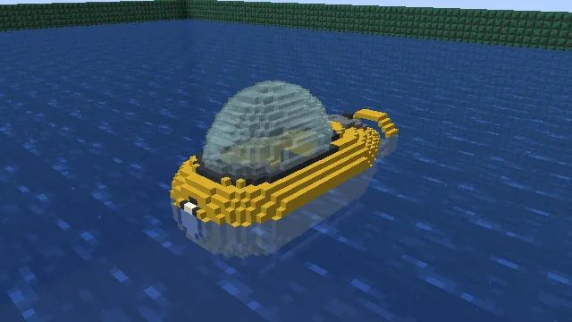
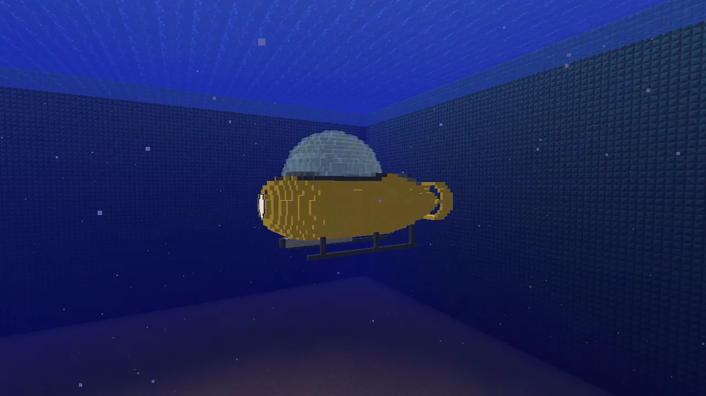
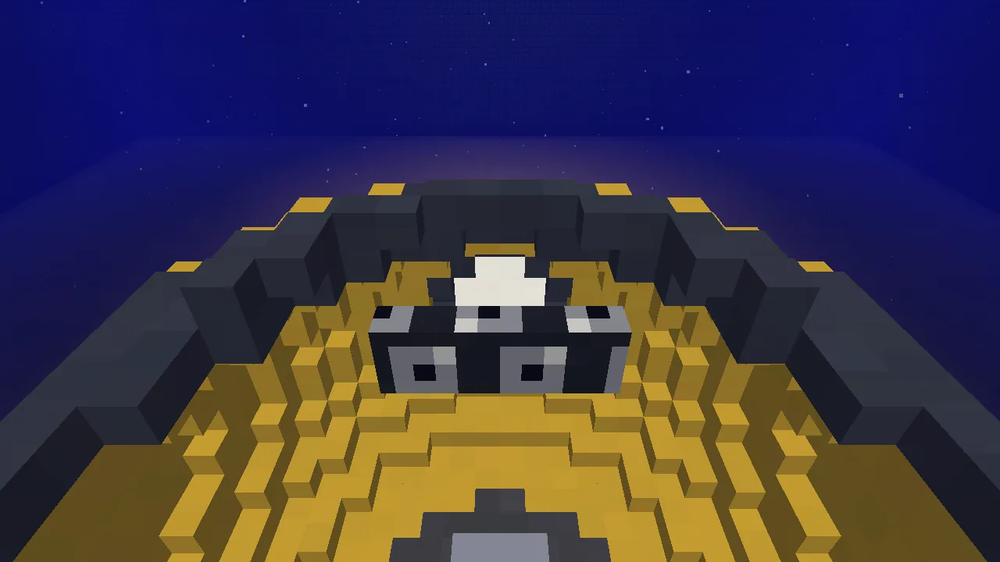
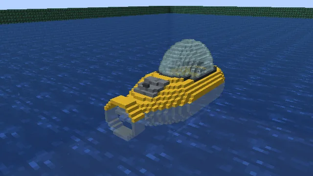
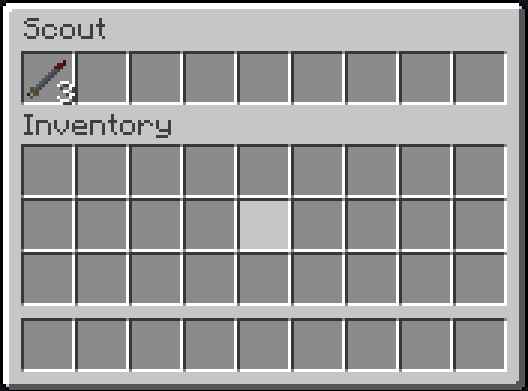

The **Scout** is a one-man submarine, one block to a metre: a yellow pod three blocks long with a
glass bubble over the pilot, a spotlight in its nose and one propeller in a ring at the tail. It is
twice as fast as the [Explorer](/wiki/explorer) and turns twice as quick, but cheap and fragile,
with a locker of one row, two upgrade slots and one torpedo tube. Diving works the same in every
[Submersibles](/wiki/submersibles) submarine, so read that page too. Keys, fuel, paint and repairs
are [Vanilla Wheels](/wiki/vanilla-wheels)'s.

## Getting one

1. **The pod**, at a crafting table: three glass blocks over copper blocks round a barrel:

   | | | |
   |---|---|---|
   | glass | glass | glass |
   | copper block | barrel | copper block |
   | | copper block | |

2. **The pod and an engine**, at a crafting table, make the Scout, packed.
3. **Right-click open water** with it to set it down. (A Mechanic Lift builds one too, from the pod
   and an engine, but on dry land: pack it and carry it to the water.)

It comes out yellow. Paint it with a dye in its fit-out (crouch and right-click the hull).

## Aboard

You sit low in the pod with your head in the bubble, so you can see all round:

**H** switches the spotlight in the nose. Down where it's dark it lights the seabed ahead.

## The locker

The locker is in the tail, under the **hatch behind the bubble**: right-click the hatch (from a dock
or swimming above it), or press your **inventory key** (E) while you're aboard. Its torpedo tube's
torpedoes go in here.

## Numbers

Top speed 0.44 blocks a tick (8.8 blocks a second); climbs and dives 0.14 a tick. 24 000 ticks of
fuel, and it burns fuel only while you drive it: about 25 minutes of driving. It is fragile: knocks
and crashes do it two thirds of their damage, nearly three times what the Explorer takes. Repairs
take **copper ingots**.
